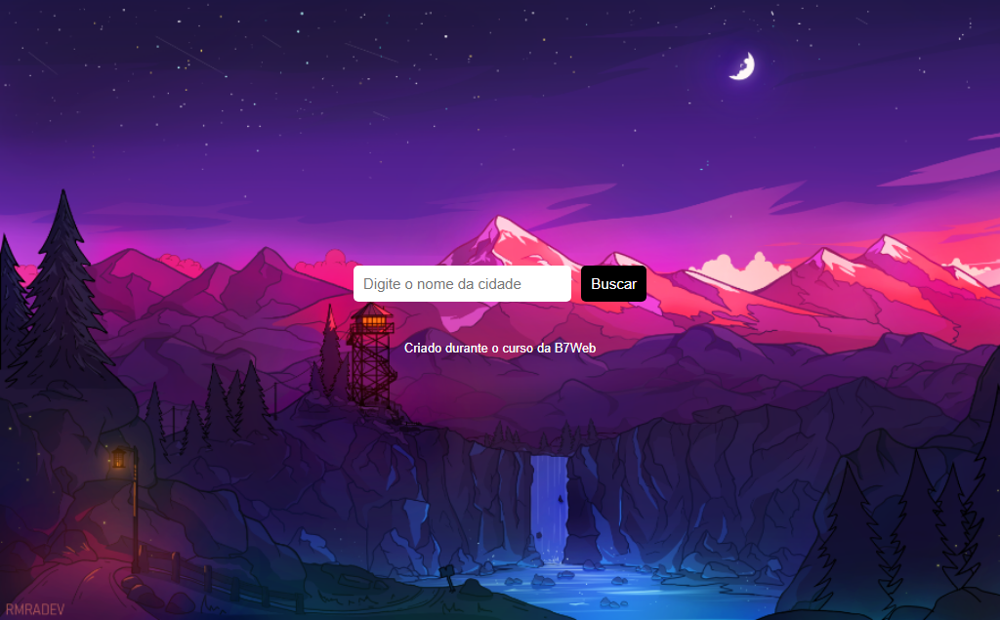

# Clima

> Site Clima

Esse é um site que foi criado para mostrar o clima de qualquer lugar do mundo. Desenvolvido no curso da B7Web.

[Clique para acessar](https://guimiiller.github.io/clima/)

## 🚀 Tecnologias

- HTML
- CSS
- JavaScript
- Git e Github

## 💻 O que aprendi

- Aprendi a fazer requisição interna para buscar as informações da API
- Aprendi manipular JSON
- Exibir as informações da API na tela

## 📨 Contato

- guilhermemillerblack@gmail.com